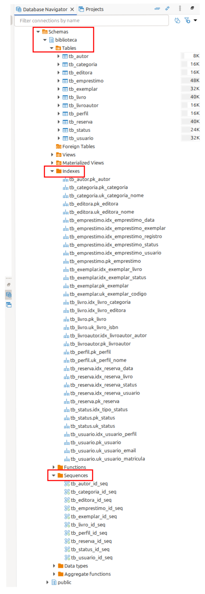
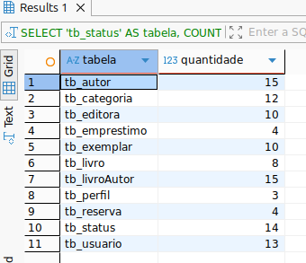
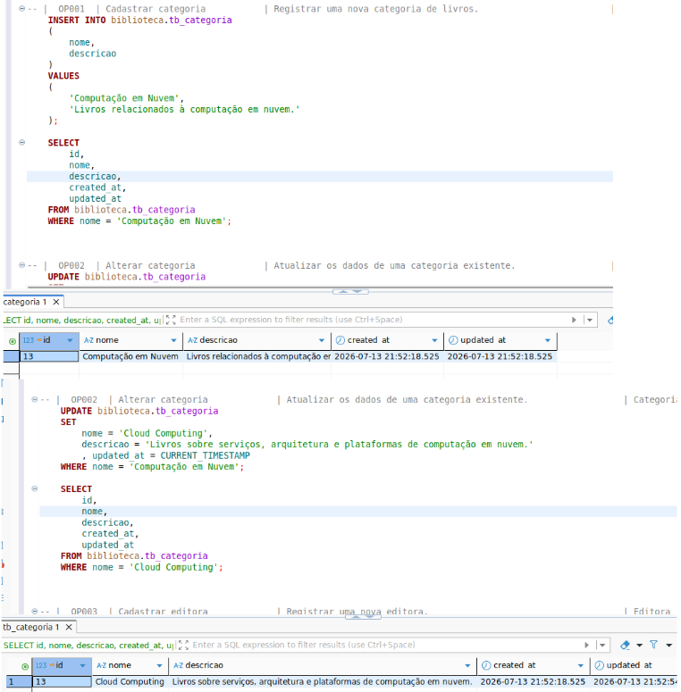
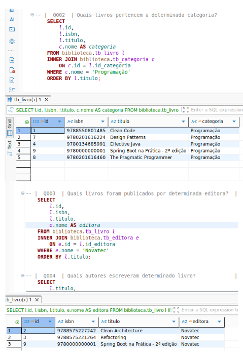
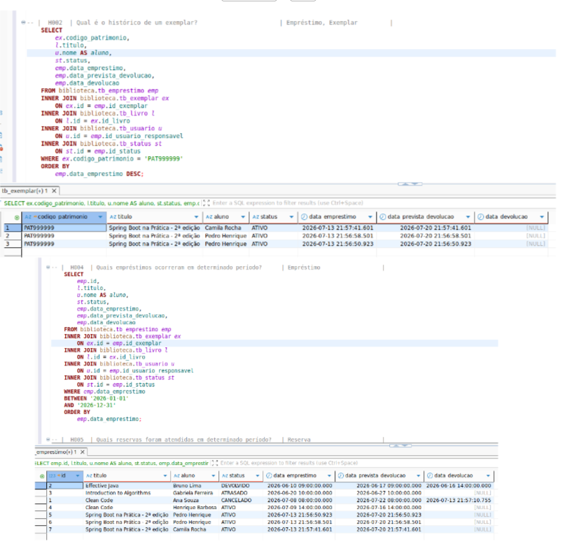
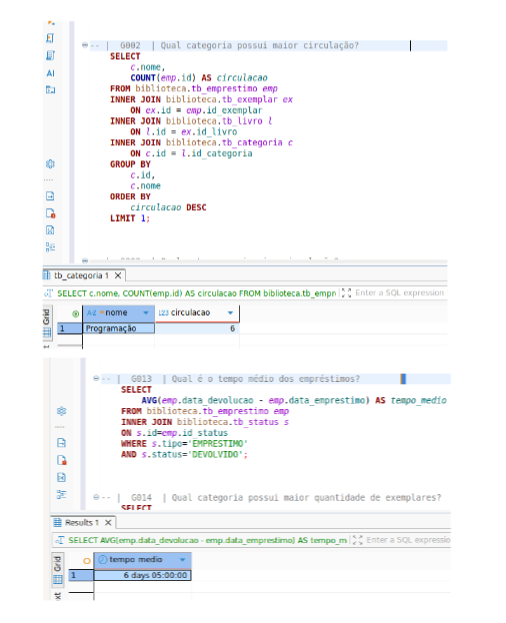

# Documento de Evidências

## Objetivo

Este documento reúne as evidências obtidas durante a validação do modelo físico do banco de dados.

Seu objetivo é demonstrar que a modelagem foi implementada com sucesso e que todas as operações e consultas previstas são suportadas pelo banco de dados.

---

# Evidência 01 — Criação do Banco de Dados

## Objetivo

Validar a criação da estrutura física do banco de dados.

### Scripts executados

> sql/05-schema_db.sql

### Resultado esperado

Todas as tabelas, constraints, relacionamentos e índices criados sem erros.

### Evidência

---

# Evidência 02 — Seed do Banco

## Objetivo

Popular todas as tabelas do sistema.

### Scripts executados

>  sql/09-seed_db.sql

### Resultado esperado

Banco populado com sucesso.

### Evidência

---

# Evidência 03 — Operações

## Objetivo

Validar as operações previstas pelo sistema.

### Operações executadas

> sql/04-validacao_modelo_dados.sql

### Resultado esperado

Todas as operações executadas com sucesso. (executei as operações, evicenciei apenas uma para não extender o documento).

### Evidência

---

# Evidência 04 — Perguntas

## Objetivo

Realizar perguntas ao modelo implementado e validar consultas operacionais.

### Consultas executadas

>  sql/04-validacao_modelo_dados.sql

### Evidência

---

# Evidência 05 — Consultas Históricas

## Objetivo

Validar a recuperação do histórico.

### Consultas executadas

>  sql/04-validacao_modelo_dados.sql

### Evidência

---

# Evidência 06 — Consultas Gerenciais

## Objetivo

Validar os indicadores produzidos pelo modelo.

### Consultas executadas

>  sql/04-validacao_modelo_dados.sql

### Evidência

---

# Resultado Final

A execução dos scripts demonstrou que:

- O modelo físico foi criado corretamente.
- As restrições de integridade foram respeitadas.
- Os relacionamentos entre entidades funcionaram conforme o esperado.
- As operações previstas pelo sistema foram executadas com sucesso.
- O banco respondeu corretamente às consultas operacionais.
- O histórico de informações foi preservado.
- O modelo suportou consultas gerenciais para geração de indicadores.

Conclui-se que a modelagem de dados atende aos requisitos funcionais definidos para o Sistema de Biblioteca Escolar.
