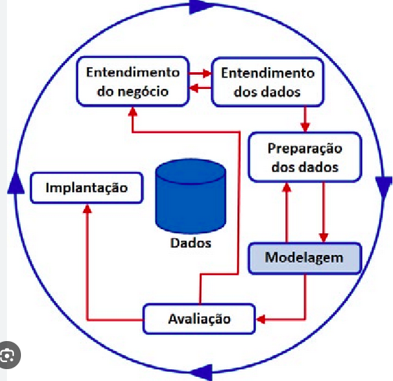

## ***Um Aviso Importante***

> O Código apresentado aqui está longe de ser perfeito. Meu foco será exclusivamente na prática de criação de um modelo de dados, que é o tema central deste projeto. Então, caro programador experiente que está lendo isso, peço que não se preocupe demais com outras questões como arquitetura ou modelagem profunda ou boas práticas. foco no essencial!

## Objetivo

Meu ojetivo com este microprojeto é praticar modelagem de dados a partir de um problema muito comum em entrevistas técnicas, além disso como programador passo a maior parte do tempo consumindo modelos do que criando, então é sempre bom praticar. [1]
Como eu pratico autoeducação, então todos passos, estruturas, ideias de projetos são minhas e por isso pode ocorre de eu não seguir o que é trivial do mercado ou considerado boas ou melhores práticas de mercado...

## Ferramentas

Utilizarei ferramentas que me permitirão implementar a modelagem além de testá-la:

- DrawDB  - para criação dos diagramas [2]
- PostgreDB  - para implementação e teste do modelo [3]
- DBeaver  - SGBD para visualizar, interagir e testar o modelo [4]
- VsCode - editor(nem vou anotar ou deixa ref rs) que usarei neste projeto para facilitar anotações, criação e uso do ambiente.

## Passos que segui para realizar o microprojeto

- levantamento de requisitos
- regras de negócio
- entidades
- DER
- dicionário de dados
- conjunto de perguntas para validar o modelo
- SQL ANSI
- adaptação para PostgreSQL

---

## Levantamento de requisitos

Em projetos reais, um analista normalmente conduz entrevistas usando perguntas abertas antes de entrar em detalhes técnicos.
*por ser um microprojeto pessoal precisarei simular a jornada de levantamento de requisitos e alguns aspectos que constróem o cenário do projeto, neste caso cai bem o uso de IA para apoiar o processo. [5]

o objetivo passar por:

- entender o negócio
  Geralmente é uma reunião de negócios onde perguntas chave são realizadas para a descoberta do contexto em que a solução será elaborada.

  - Qual Objetivo do sistema?
  - Quem utilizará o sistema?
  - Como funciona o processo atualmente?
  - Quais são os principais problemas do processo atual?
  - O que vocês esperam melhorar?
- descobrir os processos
  Após entender o contexto é possível analisar em um nível mais detalhado e olhar os processos que estão envolvidos nele.

  - Como um livro chega à biblioteca?
  - Como um aluno pega um livro emprestado?
  - Comoo ocorre uma devolução?
  - Existe reserva?
  - Existe multa?
  - Existe limite de empréstimos?
  - Os professores também utilizam a biblioteca?
  - Os funcionários podem pegar livros?
- descobrir as informações
  após o entendimento dos processos envolvidos é possível aprofundar em mais um nível de detalhamento de forma a conhecer as informações necessárias para que os processos funcionem e que eventualmente podem compor o modelo.

  - Livro:
    - O que é registrado de um livro?
    - ISBN é obrigatório?
    - Editora é importante?
    - ano de publicação é importante?
    - etc.
  - Aluno:
    - O que identifica um aluno?
    - Utiliza-se matrícula? CPF?
    - Registra-se a Turma?
    - etc.
  - Empréstimo:
    - Quais datas precisam ser registradas?
    - Existe prazo de devolução?
    - É necessário guardar histórico?
    - etc.
  - etc.
- descobrir as regras
  As regras de negócio costumam aparecer naturalmente durante as conversas, por exemplo:

  - Cada aluno só pode pegar até três livros.
  - Cada livro possui várias cópias.
  - etc.

*Em Resumo* uma boa maneira de entender o que são os requisitos de negócio: Requisitos de negócios estabelecem os critérios de sucesso para um
projeto. Ao especificar as tarefas e os recursos necessários para completar o projeto, as equipes podem visualizar com mais clareza os obstáculos e lacunas para atingir seu objetivo

para esta etapa foi *gerado* documento de levantamento de requisitos:

> 01-levantamento_requisitos.md

---

## Regras de negócio

Durante o levantamento de requisitos é possível e necessário realizar apontamentos que levam as regras de negócio que estabelecem restrições e comportamentos do sistema e que devem ser validadas junto ao cliente/usuário  para que sejam refletidas diretamente no modelo de dados e implementadas em um sistema em uma etapa seguinte. [6]

Para uma maior formalização da documentação também criei um documento a parte com as regras identificadas e o formatei utilizando IA para melhor compreensão e procurei descrever a regra, o objetivo da regra e com a IA fiz a inclusão de possíveis entidades impactadas direamente pela regra.

As regras de negócio descritas no documento viabilizam a construção do modelo conceitual, lógico e físico do banco de dados.

Durante a modelagem espera-se que essas regras resultem em:

* definição das entidades do domínio;
* identificação das cardinalidades entre entidades;
* criação de entidades associativas quando necessário;
* definição das chaves primárias e estrangeiras;
* aplicação de restrições de integridade;
* apoio ao processo de normalização.

Algumas regras serão implementadas diretamente pelo banco de dados, por meio de restrições, chaves e relacionamentos, enquanto outras dependerão de validações realizadas pela aplicação, como o bloqueio de empréstimos por atraso e o gerenciamento das reservas.

*Em resumo* uma boa forma de entender as regras de negócio:  Regras de negócio fornecem a base para sistemas de automação, tomando informações documentadas ou não documentadas. Em seguida, eles convertem essas informações em declarações condicionais que podem ter características de restrição ou derivação.

Esta etapa ficou formalizada no seguinte documento de regras se negócio:

> 02-regras_negócio.md

---

## Entidades

A identificação das entidades é um processo que começa no levantamento de requisitos como se fosse feita uma extração das entidades dos requisitos, durante as entrevistas e reuniões, e validadas posteriormente com a inclusão ou alteração e até mesmo remoção de entidades identificadas da lista pois o processo é dinâmico visando  extrair informações de um mundo ambiguo e volátil e trazer para o digital.

Basicamente o processo de identificação de entidades pode ser formalizado em uma pergunta:

> Quais são os objetos do mundo real que o sistema precisa armazenar?

Além da pergunta acima pode-se utilizar critérios que visam complementar e diminuir a abstração da análise:

Normalmente uma entidade:

- possui identidade própria
- possui atributos
- participa de relacionamentos
- precisa ser armazenada

A partir desta pergunta e dos critérios já possível identificar um conjunto de entidades iniciais:

- Livro
- Exemplar
- Autor
- Categoria
- Editora
- Empréstimo
- Reserva
- Aluno
- Bibliotecário

Além das entidades identificadas é possível identificar novas entidades ao longo do processo de requisitos e modelagem como forma de "amadurecimento" das informações, identificando inclusive entidades de apoio que existirão apenas no modelo de dados e não em uma aplicação, ou entidades que deixarão de existir e se tornarão atributos de uma outra entidade visando simpificar o modelo de dados.

Na etapa seguinte irei realizar a identificação de um subnível da entidade que são seus atributos e cardinalidades, durante a criação do diagrama para facilitar o processo e simplificar a quantidade de informação escrita. [8]

---

## DER

Nesta etapa serrão realizadas:

- identificação de entidades(novas e alteração das já encontradas)
- identificação das cardinalidades(tipos e representação de relacionamentos entre as entidades)
- normalização(estruturação, desestruturação e reestruturação se necessário de entidades para adequação das formas normais de normalização de modelo de dados)
- representação visual(diagrama) do modelo de dados.

==Obs.:== 

> Conforme mencionado na etapa anterior estou concentro etapas na parte visual para evitar excesso de anotações, pois não costumo anotar muito coisas que posso encontrar na bibliografia então procuro criar minhas notas como pontos de referência para recaptulação, replicação e reflexão do que foi encontrado nas pesquisas e construído em um projeto.

---

## Dicionário de dados

## Conjunto de perguntas para validar o modelo

## SQL ANSI

## Adaptação para PostgreSQL

---

## Bibliografia

[1] [github.com/rafael-o-cunha/Curso-Modelagem-de-dados-Boson-Treinamentos](https://github.com/rafael-o-cunha/Curso-Modelagem-de-dados-Boson-Treinamentos)

[1.1] [www.devmedia.com.br/guia/requisitos-modelagem-e-uml/35697](https://www.devmedia.com.br/guia/requisitos-modelagem-e-uml/35697)

[1.2] [www.devmedia.com.br/guia/modelagem-de-dados/34654](https://www.devmedia.com.br/guia/modelagem-de-dados/34654)

[2] https://drawdb.vercel.app/

[3] https://www.postgresql.org/

[3.1] https://hub.docker.com/_/postgres

[3.2] https://renatogroffe.medium.com/postgresql-docker-compose-criando-rapidamente-ambientes-e-populando-bases-para-testes-6c4b9a4de313

[4] https://dbeaver.io/

[5] https://adelpha-api.mackenzie.br/server/api/core/bitstreams/d734b431-d2c8-43c4-944c-a87d165069d0/content

[5.1] https://www.inf.puc-rio.br/wer/WERpapers/artigos/artigos_WER08/zaniro.pdf

[5.2] https://docente.ifsc.edu.br/joao.augusto/MaterialDidatico/2018-1/An%C3%A1lise%20e%20Projeto%20de%20Sistemas/Levantamento%20dos%20Requisitos.pdf

[6] [www.ibm.com/br-pt/think/topics/business-rules](https://www.ibm.com/br-pt/think/topics/business-rules)

[6.1] [www.devmedia.com.br/gestao-de-regras-de-negocios/30670](https://www.devmedia.com.br/gestao-de-regras-de-negocios/30670)

[7] [www.researchgate.net/figure/Figura-3-Destaque-para-modelagem-no-processo-de-mineracao-de-dados_fig1_367163182](https://www.researchgate.net/figure/Figura-3-Destaque-para-modelagem-no-processo-de-mineracao-de-dados_fig1_367163182)

[8] [www.devmedia.com.br/tecnologias-de-banco-de-dados-e-modelagem-de-dados/1660](https://www.devmedia.com.br/tecnologias-de-banco-de-dados-e-modelagem-de-dados/1660)

[8.1] [apps.univesp.br/novotec/modelagem-de-dados](https://apps.univesp.br/novotec/modelagem-de-dados/)

[8.2] [www.devmedia.com.br/modelagem-de-dados-2-os-relacionamentos/4142](https://www.devmedia.com.br/modelagem-de-dados-2-os-relacionamentos/4142)
