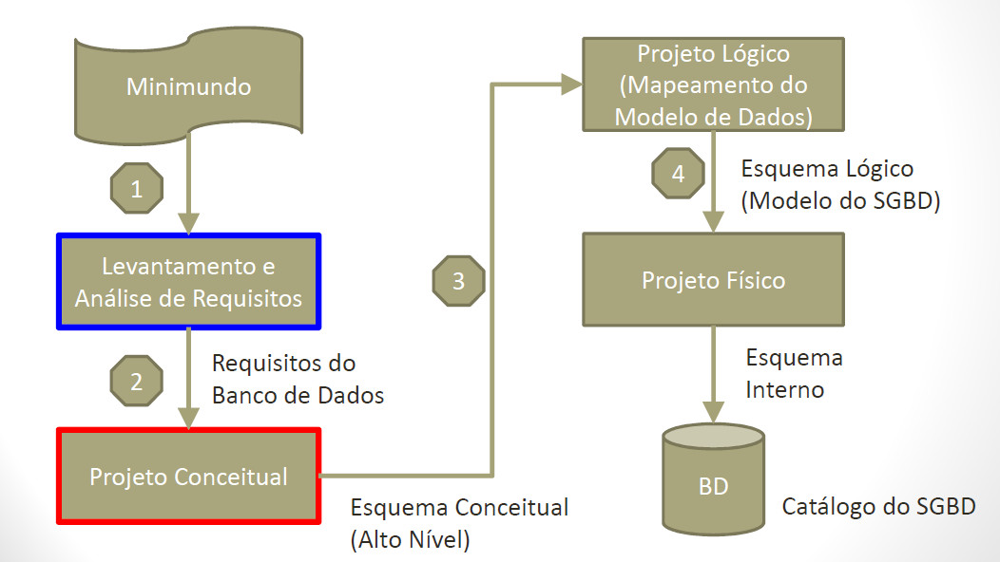
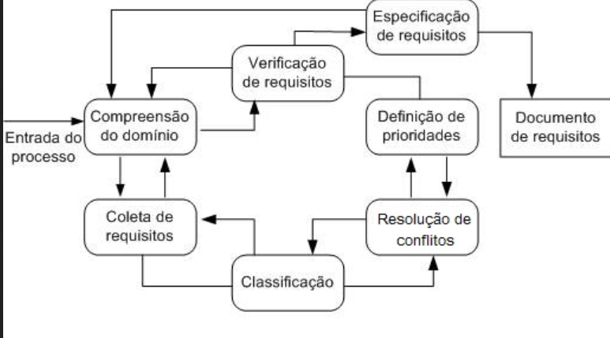
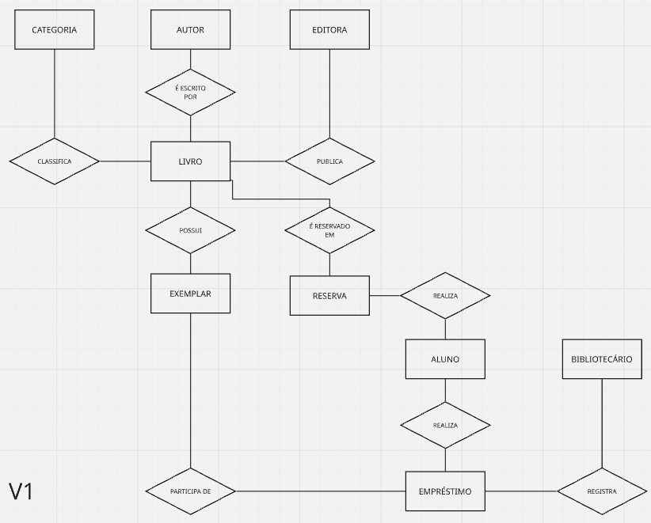
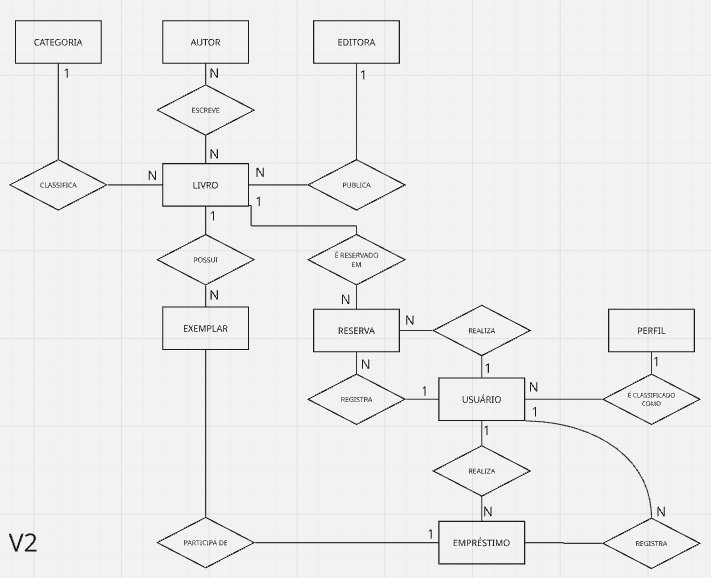
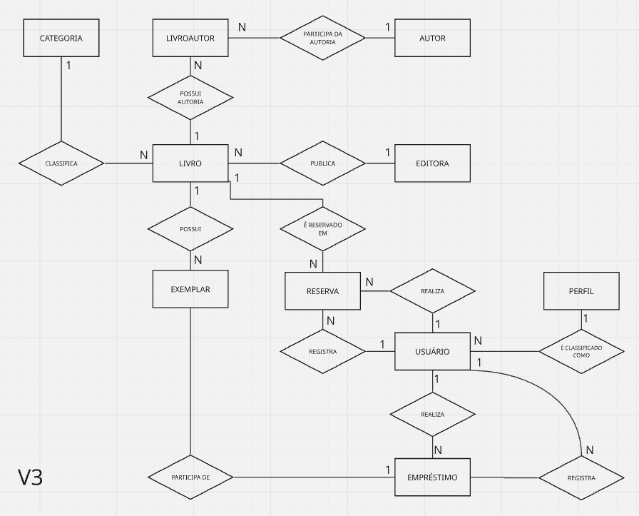
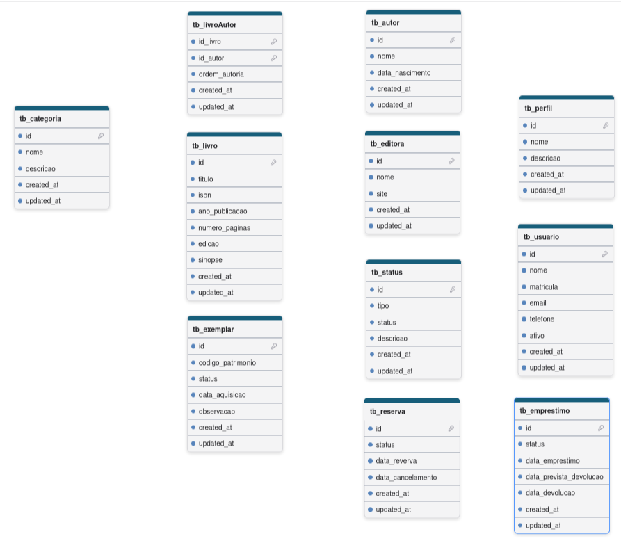
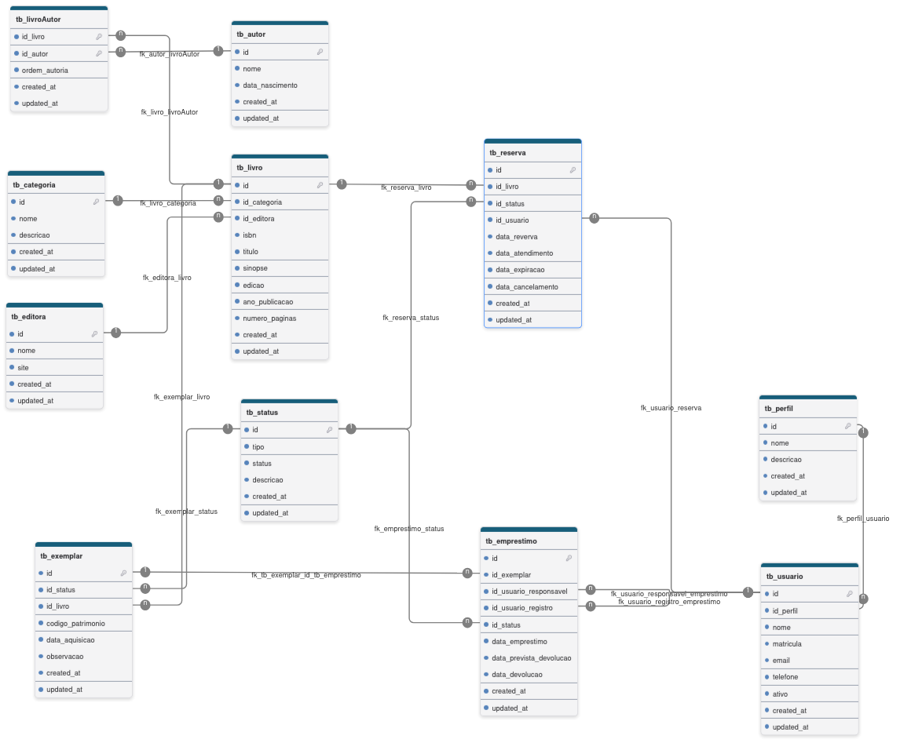
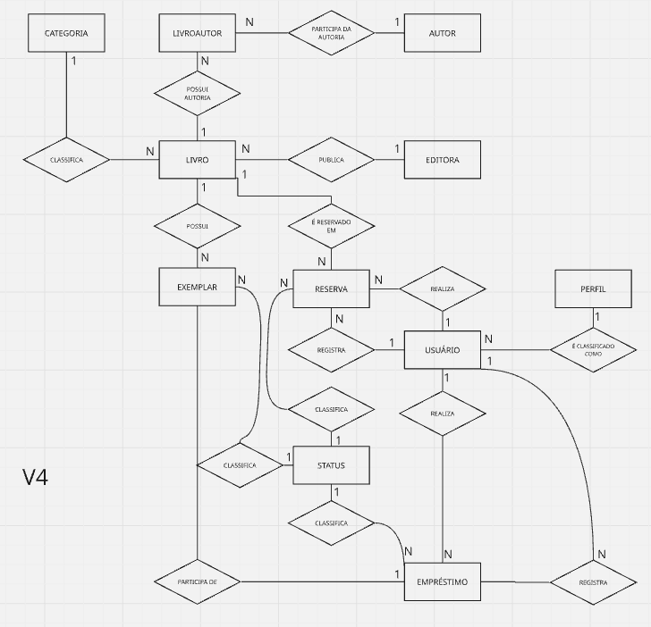
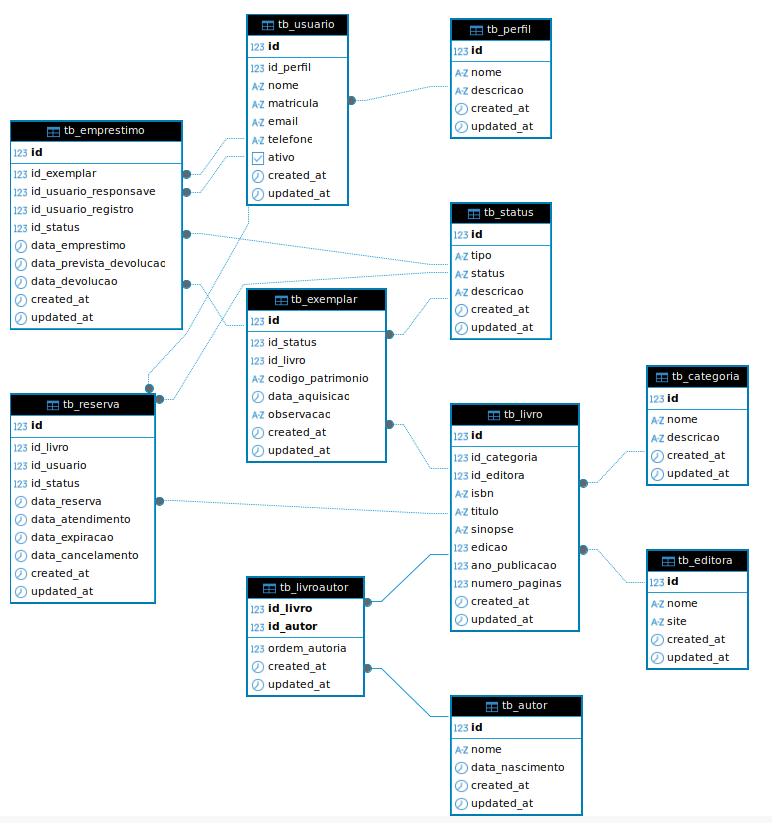

## ***Um Aviso Importante***

> O Código apresentado aqui está longe de ser perfeito. Meu foco será exclusivamente na prática de criação de um modelo de dados, que é o tema central deste projeto. Então, caro programador experiente que está lendo isso, peço que não se preocupe demais com outras questões como arquitetura ou modelagem profunda ou boas práticas. foco no essencial!

## Objetivo

Meu ojetivo com este microprojeto é praticar modelagem de dados a partir de um problema muito comum em entrevistas técnicas, além disso como programador passo a maior parte do tempo consumindo modelos do que criando, então é sempre bom praticar. [1]
Como eu pratico autoeducação, então todos passos, estruturas, ideias de projetos são minhas e por isso pode ocorre de eu não seguir o que é trivial do mercado ou considerado boas ou melhores práticas de mercado...

==Obs.:==

> A organização do projeto ao longo do desenvolvimento se dará por nível de abstração seguindo a seguinte sequência:
> Negócio -> DER Conceitual -> Modelo Lógico -> Dicionário de dados -> Modelo Fìsico.

## Ferramentas

Utilizarei ferramentas que me permitirão implementar a modelagem além de testá-la:

- DrawDB e Miro - para criação dos diagramas [2]
- PostgreDB  - para implementação e teste do modelo [3]
- DBeaver  - SGBD para visualizar, interagir e testar o modelo [4]
- VsCode - editor(nem vou anotar ou deixa ref rs) que usarei neste projeto para facilitar anotações, criação e uso do ambiente.

## Passos que segui para realizar o microprojeto

- Levantamento de requisitos
- Regras de negócio
- Entidades
- DER
- Dicionário de dados
- Conjunto de perguntas para validar o modelo
- SQL ANSI

---

## Levantamento de requisitos

Em projetos reais, um analista normalmente conduz entrevistas usando perguntas abertas antes de entrar em detalhes técnicos.
*por ser um microprojeto pessoal precisarei simular a jornada de levantamento de requisitos e alguns aspectos que constróem o cenário do projeto, neste caso cai bem o uso de IA para apoiar o processo. [5]

o objetivo passar por:

- entender o negócio
  Geralmente é uma reunião de negócios onde perguntas chave são realizadas para a descoberta do contexto em que a solução será elaborada.

  - Qual Objetivo do sistema?
  - Quem utilizará o sistema?
  - Como funciona o processo atualmente?
  - Quais são os principais problemas do processo atual?
  - O que vocês esperam melhorar?
- descobrir os processos
  Após entender o contexto é possível analisar em um nível mais detalhado e olhar os processos que estão envolvidos nele.

  - Como um livro chega à biblioteca?
  - Como um aluno pega um livro emprestado?
  - Comoo ocorre uma devolução?
  - Existe reserva?
  - Existe multa?
  - Existe limite de empréstimos?
  - Os professores também utilizam a biblioteca?
  - Os funcionários podem pegar livros?
- descobrir as informações
  após o entendimento dos processos envolvidos é possível aprofundar em mais um nível de detalhamento de forma a conhecer as informações necessárias para que os processos funcionem e que eventualmente podem compor o modelo.

  - Livro:
    - O que é registrado de um livro?
    - ISBN é obrigatório?
    - Editora é importante?
    - ano de publicação é importante?
    - etc.
  - Aluno:
    - O que identifica um aluno?
    - Utiliza-se matrícula? CPF?
    - Registra-se a Turma?
    - etc.
  - Empréstimo:
    - Quais datas precisam ser registradas?
    - Existe prazo de devolução?
    - É necessário guardar histórico?
    - etc.
  - etc.
- descobrir as regras
  As regras de negócio costumam aparecer naturalmente durante as conversas, por exemplo:

  - Cada aluno só pode pegar até três livros.
  - Cada livro possui várias cópias.
  - etc.

*Em Resumo* uma boa maneira de entender o que são os requisitos de negócio: Requisitos de negócios estabelecem os critérios de sucesso para um
projeto. Ao especificar as tarefas e os recursos necessários para completar o projeto, as equipes podem visualizar com mais clareza os obstáculos e lacunas para atingir seu objetivo

para esta etapa foi *gerado* documento de levantamento de requisitos:

> 01-levantamento_requisitos.md

---

## Regras de negócio

Durante o levantamento de requisitos é possível e necessário realizar apontamentos que levam as regras de negócio que estabelecem restrições e comportamentos do sistema e que devem ser validadas junto ao cliente/usuário  para que sejam refletidas diretamente no modelo de dados e implementadas em um sistema em uma etapa seguinte. [6]

Para uma maior formalização da documentação também criei um documento a parte com as regras identificadas e o formatei utilizando IA para melhor compreensão e procurei descrever a regra, o objetivo da regra e com a IA fiz a inclusão de possíveis entidades impactadas direamente pela regra.

As regras de negócio descritas no documento viabilizam a construção do modelo conceitual, lógico e físico do banco de dados.

Durante a modelagem espera-se que essas regras resultem em:

* definição das entidades do domínio;
* identificação das cardinalidades entre entidades;
* criação de entidades associativas quando necessário;
* definição das chaves primárias e estrangeiras;
* aplicação de restrições de integridade;
* apoio ao processo de normalização.

Algumas regras serão implementadas diretamente pelo banco de dados, por meio de restrições, chaves e relacionamentos, enquanto outras dependerão de validações realizadas pela aplicação, como o bloqueio de empréstimos por atraso e o gerenciamento das reservas.

*Em resumo* uma boa forma de entender as regras de negócio:  Regras de negócio fornecem a base para sistemas de automação, tomando informações documentadas ou não documentadas. Em seguida, eles convertem essas informações em declarações condicionais que podem ter características de restrição ou derivação.

Esta etapa ficou formalizada no seguinte documento de regras se negócio:

> 02-regras_negocio.md

---

## Entidades

A identificação das entidades é um processo que começa no levantamento de requisitos como se fosse feita uma extração das entidades dos requisitos, durante as entrevistas e reuniões, e validadas posteriormente com a inclusão ou alteração e até mesmo remoção de entidades identificadas da lista pois o processo é dinâmico visando  extrair informações de um mundo ambiguo e volátil e trazer para o digital.

Basicamente o processo de identificação de entidades pode ser formalizado em uma pergunta:

> Quais são os objetos do mundo real que o sistema precisa armazenar?

Além da pergunta acima pode-se utilizar critérios que visam complementar e diminuir a abstração da análise:

Normalmente uma entidade:

- possui identidade própria
- possui atributos
- participa de relacionamentos
- precisa ser armazenada

A partir desta pergunta e dos critérios já possível identificar um conjunto de entidades iniciais:

- Livro
- Autor
- Editora
- Categoria
- Exemplar
- Aluno
- Bibliotecário
- Empréstimo
- Reserva

Além das entidades identificadas é possível identificar novas entidades ao longo do processo de requisitos e modelagem como forma de "amadurecimento" das informações, identificando inclusive entidades de apoio que existirão apenas no modelo de dados e não em uma aplicação, ou entidades que deixarão de existir e se tornarão atributos de uma outra entidade visando simpificar o modelo de dados.

Na etapa seguinte irei realizar a identificação de um subnível da entidade que são seus atributos e cardinalidades, durante a criação do diagrama para facilitar o processo e simplificar a quantidade de informação escrita. [8]

---

## DER

Nesta etapa serrão realizadas:

- identificação de entidades(novas e alteração das já encontradas)
- identificação das cardinalidades(tipos e representação de relacionamentos entre as entidades)
- normalização(estruturação, desestruturação e reestruturação se necessário de entidades para adequação das formas normais de normalização de modelo de dados)
- representação visual(diagrama) do modelo de dados.

==Obs.:==

> Conforme mencionado na etapa anterior estou concentro etapas na parte visual para evitar excesso de anotações, pois não costumo anotar muito coisas que posso encontrar na bibliografia então procuro criar minhas notas como pontos de referência para recaptulação, replicação e reflexão do que foi encontrado nas pesquisas e construído em um projeto.

A construção de um DER visa mostrar os itens mencionados acima(entidades, relacionamentos e cardinalidades) e basicamente deve responder perguntas como:

- Um livro possui quantos exemplares?
- Um aluno pode possuir quantos empréstimos?
- Um empréstimo pertence a quantos alunos?

==Obs.:==

> Um DER é um modelo conceitual e normalmente não possui tipos de dados, índices e constraints, porém neste microprojeto irei criar os dois modelos, o conceitual (sem representar atributos) e o lógico representando atributos sem detalhar seus tipos e constraints pois isso deixarei para o dicionário de dados. [9]
>
> O Modelo conceitual será criado usando *Miro* que possui elementos de fácil uso e lousa infinita.
> O modelo lógico será criado no *Draw DB* como mencionado  no início das minhas anotações.

A partir deste ponto quero buscar responder as seguintes perguntas:

> Como uma entidade se relaciona com a outra?
> Quem se relaciona?
> Qual verbo que representa esse relacionamento?
> Qual a cardinalidade?

Para respondê-la é possível realizar afirmações do tipo:

- possui
- tem um
- é publicado por
- pertence a
- etc.

com isso consigo criar um catálogo pra resumir o processo até o momento e então criar o diagrama a partir dele.

## V1

## Catálogo de Relacionamentos

| Código | Origem    | Verbo           | Destino     | Cardinalidade | Obrigatório | Regra(s) de Negócio |
| :-----: | --------- | --------------- | ----------- | :-----------: | :----------: | -------------------- |
|   R01   | Livro     | possui          | Exemplar    |      1:N      |     Sim     | RN03, RN04           |
|   R02   | Editora   | publica         | Livro       |      1:N      |     Sim     | RN09, RN10           |
|   R03   | Categoria | classifica      | Livro       |      1:N      |     Sim     | RN07, RN08           |
|   R04   | Livro     | é escrito por  | Autor       |      N:N      |     Sim     | RN05, RN06           |
|   R05   | Usuário  | realiza         | Empréstimo |      1:N      |     Não     | RN01                 |
|   R06   | Usuário  | registra        | Empréstimo |      1:N      |     Sim     | RN14                 |
|   R07   | Exemplar  | participa de    | Empréstimo |      1:N      |     Não     | RN02                 |
|   R08   | Usuário  | realiza         | Reserva     |      1:N      |     Não     | RN12                 |
|   R09   | Livro     | é reservado em | Reserva     |      1:N      |     Não     | RN12                 |
|   R10   | Perfil    | é atribuído a | Usuário    |      1:N      |     Sim     | RN15                 |

Transformando as anotações do catálogo que criado a partir das relações respondidas e afirmadas coloquei no diagrama as entidades (retângulos) e usei Losangos para relacioná-las e seguir o básico da simbologia para DER/MER [10]

vou deixar saldo a primeira versão aqui para manter o histórico.

A partir da V1 é possível refletir diversos aspectos da modelagem e já observar tratamentos que precisam ser feitos ligados a cardinalidade de relações N:N.

- As entidades Aluno e Bibliotecáriio podem amadurecer e mudar pois tendem a ter praticamente os mesmos dados, indicando ==perfil== de ==usuário== do sistema então poderá ser: usuário -> possui -> perfil
- - visualmente a rerepresentação do modelo na próxima versão muda, mas a primeira está correta, a otimização é apenas uma transformação destas entidades de domínio para aspecto de autorização de um sistema.
- O empréstimo ficará: usuário -> registra empréstimo, sendo usuário tanto Aluno quanto Bibliotecário, logo o empréstimo continua se relacionando com as duas entidades originais porém sendo identificado agora por meio de atributos.
- O empréstimo é identificado como entidade fraca pois para existir depende do aluno, porém pode ser uma entidade muito importante no modelo, dado que um dos requisitos é o registro histórico, então esta entidade representa a movimentação de entrada e saída de exemplares com datas e responsáveis na operação.

==Obs.:==

> Dado a importância da entidade Empréstimo que terá uma responsabilidade clara de Histórico faz sentido reavaliar regras de negócio e nesse processo criei uma nova regra, a ==RN14==

==Obs.:==

> Dado a alteração para V2 sobre as entidades Aluno e Bibliotecário na representação do DER e catálogo faz sentido reavaliar regras de negócio e nesse processo criei uma nova regra, a ==RN15==

## V2

### Atualizando o catálogo e o diagrama:

|   Código   | Origem    | Verbo           | Destino     | Cardinalidade | Obrigatório | Regra(s) de Negócio |
| :---------: | --------- | --------------- | ----------- | :-----------: | :----------: | -------------------- |
|     R01     | Livro     | possui          | Exemplar    |      1:N      |     Sim     | RN03, RN04           |
|     R02     | Editora   | publica         | Livro       |      1:N      |     Sim     | RN09, RN10           |
|     R03     | Categoria | classifica      | Livro       |      1:N      |     Sim     | RN07, RN08           |
|     R04     | Livro     | é escrito por  | Autor       |      N:N      |     Sim     | RN05, RN06           |
| ==R05== | Usuário  | realiza         | Empréstimo |      1:N      |     Não     | RN01                 |
| ==R06== | Usuário  | registra        | Empréstimo |      1:N      |     Sim     | RN14                 |
|     R07     | Exemplar  | participa de    | Empréstimo |      1:N      |     Não     | RN02                 |
| ==R08== | Usuário  | realiza         | Reserva     |      1:N      |     Não     | RN12                 |
|     R09     | Livro     | é reservado em | Reserva     |      1:N      |     Não     | RN12                 |
| ==R10== | Perfil    | é atribuído a | Usuário    |      1:N      |     Sim     | RN15                 |

## V3

- identificando relações N:N e tratando para a próxima versão do modelo, o que naturalmente produz entidades auxiliares associativas. [11]
- Um banco de dados não implementa diretamente uma relação N:N, ao contrário disso costuma implementar um tratamento com entidade associativa transformando em relacionamento 1:N com esta entidade, no caso desse microprojeto eu tive um N:N em Livro - Autor, e que para versão 3 do modelo ficará como: Livro -> LivroAutor -> Autor para resolver o problema da cardinalidade.

## Catálogo de Relacionamentos (V3)

|   Código   | Origem    | Verbo                | Destino     | Cardinalidade | Obrigatório | Regra(s) de Negócio |
| :---------: | --------- | -------------------- | ----------- | :-----------: | :----------: | -------------------- |
|     R01     | Livro     | possui               | Exemplar    |      1:N      |     Sim     | RN03, RN04           |
|     R02     | Editora   | publica              | Livro       |      1:N      |     Sim     | RN09, RN10           |
|     R03     | Categoria | classifica           | Livro       |      1:N      |     Sim     | RN07, RN08           |
| ==R04== | Livro     | possui autoria       | LivroAutor  |      1:N      |     Sim     | RN05, RN06           |
| ==R05== | Autor     | participa da autoria | LivroAutor  |      1:N      |     Sim     | RN05, RN06           |
|     R06     | Usuário  | realiza              | Empréstimo |      1:N      |     Não     | RN01                 |
|     R07     | Usuário  | registra             | Empréstimo |      1:N      |     Sim     | RN14                 |
|     R08     | Exemplar  | participa de         | Empréstimo |      1:N      |     Não     | RN02                 |
|     R09     | Usuário  | realiza              | Reserva     |      1:N      |     Não     | RN12                 |
|     R10     | Usuário  | registra             | Reserva     |      1:N      |     Sim     | RN16                 |
|     R11     | Livro     | é reservado em      | Reserva     |      1:N      |     Não     | RN12                 |
|     R12     | Perfil    | classifica           | Usuário    |      1:N      |     Sim     | RN15                 |

- A V3 fecha o diagrama e os atributos das entidades levarei para o modelo lógico e o detalhamento de tipo, constraints e etc deixarei para o dicionario de dados para não poluir os diagramas.

## Diagrama Lógico

Nesta etapa eu desci mais um nível de abstração para olhar os detalhes de cada entidade, onde abordo os atributos e coloquei seus detalhes no dicionário de dados para não poluir os diagramas.

No diagrama lógico comecei a realizar perguntas para listar os atributos e identificá-los como:

- Qual atributo identifica unicamente cada entidade?
- Quais atributos nunca podem se repetir?
- Quais atributos são obrigatórios?
- Quais atributos aceitam nulo?

O detalhamento de informações do modelo lógico de dará pela lista de atributos e quais são chaves primária/estrangeira, os tipos de dados e suas constraints estarão no dicionário de dados para manter o diagrama mais limpo.

O modelo começa a se descobrar representando atributos de negócio e atributos técnicos  de forma a viabilizar e formalizar o funcionamento de um futuro sistema.

## V1

Neste ponto eu criei um print representando o V1, antes de começar a relacionar as entidades e já e possível ver a criação de uma nova entidade (status) que auxilia as entidades: exemplar, emprestimo e reserva, decidi criar essa entidade para controle e sendo uma só para não inchar  muito o modelo.

## V2

Para evolução do modelo lógico realizei as ligações entre as entidades(relacionamentos e cardinalidades) e também defini os atributos chaves das entidades.

O detalhamento de cada atributo ficará presente no dicionário de dados, representando o próximo nível de abstração da modelagem antes do modelo físico.

==Obs.:==

> dado a evolução do modelo a partir do modelo lógico decidi fazer uma revisão nas etapas anteriores pois agora temos uma nova entidade presente no modelo "status".

- Acrescentei no documento de regras de negócio duas novas regras: ==RN16== e ==RN17== que materializam o uso da nova entidade (status) e dos atributos de criação e atualização de registros(created_at e updated_at)
- O catálogo de relacionamentos passa a ter novos 3 relacionamentos documentados: ==R13==, ==R14== e ==R15== que descrevem os relacionamentos com a entidade "status"

## Inclusão no Catálogo de Relacionamentos

| Código | Origem | Verbo      | Destino     | Cardinalidade | Obrigatório | RN   |
| ------- | ------ | ---------- | ----------- | ------------- | ------------ | ---- |
| R13     | Status | classifica | Exemplar    | 1:N           | Sim          | RN16 |
| R14     | Status | classifica | Reserva     | 1:N           | Sim          | RN16 |
| R15     | Status | classifica | Empréstimo | 1:N           | Sim          | RN16 |

## V4 do DER conceitual.

O DER conceitual também evolui buscando representar a entidade Status gerando uma V4 do modelo e acompanhando o modelo lógico.

---

## Dicionário de dados

Conforme mencionei anteriormente eu deixei o modelo conceitual e lógico mais simples, sem detalhamento dos atributos para que ficassem definidos no dicionário de dados e assim pudesse ter uma presença relevante de cada artefato da modelagem praticado.

Para criação do dicionário de dados usei um modelo que defini após pesquisas e que acredito ser o suficiente para o microprojeto. [12]

Cada entidade terá um conjunto de dados espeficados no dicionário de dados:

- Descrição
- Atributos (Campo, Tipo, PK, FK, NN, UK, Default e Descrição)
- Restrições
- Regras de negócio relacionadas

O arquivo com o dicionário de dados está definido como:

> 03-dicionario_dados.md

para acelerar a criação desde documento, utilizei IA, e a partir de todo contexto até aqui anotado durante o desenvolvimento o doc foi gerado no formato que especifiquei e após isso revisado por mim.

---

## Conjunto de perguntas para validar o modelo

Para saber se o modelo atende as necessidades de negócio eu tenho a ideia de fazer perguntas ao modelo que posteriormente serão materializadas em querys que são executadas para estar toda estrutura das entidades e relações.

Além das perguntas que se materializam am consultas eu também penso que seja interessante realização de operações, simulando um sistema, então deixei tudo isso junto.

Dado a quantidade de operações e pergunras possíveis que podem ser feitas a este modelo durante a prática do microprojeto, optei por delegar parte da criação a uma IA para apoiar o processo, durante o refinamento deixei apenas as perguntas e operações pertinentes  e ou implementei apenas as que achei pertinentes no momento para a prática, após isso solicitei formatação do documento para IA buscando simplificá-lo e torná-lo objetivo.

Para as perguntas e operações criei o documento:

> 04-valicao_modelo_dados.md

A materialização das perguntas em Script SQL foi inserida em outro arquivo.

---

## Materialização do Modelo de dados em uma base de dados populada

Para materialização do Modelo conceitual e lógico em um modelo físico e com massa de dados utilizei container Docker com imagem do postgres para facilitar e um Makefile para realizar os comandos de forma mais simples na hora de gerir o ambiente.

Para materialização do modelo 2 scripts foram criados, o script da estrutura do banco e o script que gera a primeira massa de dados(seed) do banco.

Os arquivos com os scripts são:

> sql/05-schema_db.sql

Para criação do banco, materializando o modelo de dados fiz uso de recursos básicos que compõe as tabelas, buscando respeitar ANSI SQL e aplicando a notação PostgreSQL sempre que possível, além disso os tipos de dados utilizados são os básicos que atendem a prática deste microprojeto. [15]

Usei recursos como:

- Tipos dedados
  - Integer, varchar, text, date, timestamp, boolean
- Gração de chaves
  - auto incremento, generated always as identity(cria uma coluna cujo valor é gerado automaticamente pelo PostgreSQL, usando uma *sequence* interna.)
- Restrições
  - primary key, foreign key, unique, check, not null, default
- Integridade referencial
  - FK 1:N, FK Composta, PK composta
- índices
  - create index(do Postgres), índices em FK, Índices para pesquisa [14]
- Auditoria
  - created_at, updated_at
- Convenções de nomeclatura
  - tb_, pk_, fk_, uk_, ck_, idx_ (Redgate, SQL Server, Oracle, PostgreSQL community + uso comum em projetos corporativos)
- Recursos do Postgres
  - create schema, set search_path, text, generated aways as identity

Em um outro projeto pretendo usar:

- comment on, BigInt

Um ponto relevante que vejo no mercado é o uso de estratégias de otimização de consultas sempre que possível, o que inclui o uso de índices em base de dados, procurei aplicar esta parte para experimentar [13]

### Seed

Para validar o modelo materializado(banco de dados criado no postgres) precisei seguir uma sequência que respeitasse as foreign keys, que foi a seguinte ordem:

- status
- perfil
- categoria
- editora
- autor
- livro
- livro_autor
- usuario
- exemplar
- reserva
- emprestimo

Para realização do seed utilizei IA para acelerar o processo de criação de massa de dados.

Para realização do seed criei o script no arquivo:

> 06-seed_db.sql

Uma diferença legal que usei nos scripts citados acima é que no primeiro (criação do db) usei `set search_path to` para que os artefatos fossem criados no `schema biblioteca` pois o padrão seria criar o `schema public` já no outro script (de seed) apenas usei o prefixo em cada chamada como por exemplo: `select * from biblioteca.tb_livro` . [16]

- No contexto que citei a diferença está que o primeiro modo funciona na sessão do editor (dbeaver no caso), se fechar e abrir novamente a conexão/editor teria de setar novamente se não a criação dos artefatos iriam para o `schema public` no outro isso e evitado pois a cada chamada  de execução de query o prefixo é enviado junto.

---

## Realizando Operações no banco de dados que materializa o modelo para validá-lo a partir do documento de validação

Uma maneira interessante de validar o modelo de dados é realizar perguntas a ele, operações e observar se atende as necessidades especificadas nos requisitos e regras de negócio ou se é preciso realizar alterações.

Para validação como citado anteriormente, o modelo foi materializado em um db postgres, logo as operações e perguntas que realizei foram neste banco.

As operações e perguntas podem ser encontradas no arquivo:

> 04-validacao_modelo_dados.md

A implementação das operações e perguntas podem ser encontradas no arquivo:

> sql/07-validacao_modelo_dados.sql

Separei os scripts de validação em 4 partes:

- Operações
- Perguntas
- Histórico
- Governança

baseado nessas classificações, foram executados  e o modelo se comportou devidamente.

Não fiz uma apuração profunda dos resultados apenas de alguns scripts executados.

criei um doc de evidências que visa registrar algumas operações realizadas para validação do modelo de dados.

> docs/05-evidencias_validacao.md

---

## Bibliografia

[1] [github.com/rafael-o-cunha/Curso-Modelagem-de-dados-Boson-Treinamentos](https://github.com/rafael-o-cunha/Curso-Modelagem-de-dados-Boson-Treinamentos)

[1.1] [www.devmedia.com.br/guia/requisitos-modelagem-e-uml/35697](https://www.devmedia.com.br/guia/requisitos-modelagem-e-uml/35697)

[1.2] [www.devmedia.com.br/guia/modelagem-de-dados/34654](https://www.devmedia.com.br/guia/modelagem-de-dados/34654)

[2] https://drawdb.vercel.app/

[2.1] [miro.com](https://miro.com/)

[3] https://www.postgresql.org/

[3.1] https://hub.docker.com/_/postgres

[3.2] https://renatogroffe.medium.com/postgresql-docker-compose-criando-rapidamente-ambientes-e-populando-bases-para-testes-6c4b9a4de313

[4] https://dbeaver.io/

[5] https://adelpha-api.mackenzie.br/server/api/core/bitstreams/d734b431-d2c8-43c4-944c-a87d165069d0/content

[5.1] https://www.inf.puc-rio.br/wer/WERpapers/artigos/artigos_WER08/zaniro.pdf

[5.2] https://docente.ifsc.edu.br/joao.augusto/MaterialDidatico/2018-1/An%C3%A1lise%20e%20Projeto%20de%20Sistemas/Levantamento%20dos%20Requisitos.pdf

[6] [www.ibm.com/br-pt/think/topics/business-rules](https://www.ibm.com/br-pt/think/topics/business-rules)

[6.1] [www.devmedia.com.br/gestao-de-regras-de-negocios/30670](https://www.devmedia.com.br/gestao-de-regras-de-negocios/30670)

[7] [www.researchgate.net/figure/Figura-3-Destaque-para-modelagem-no-processo-de-mineracao-de-dados_fig1_367163182](https://www.researchgate.net/figure/Figura-3-Destaque-para-modelagem-no-processo-de-mineracao-de-dados_fig1_367163182)

[8] [www.devmedia.com.br/tecnologias-de-banco-de-dados-e-modelagem-de-dados/1660](https://www.devmedia.com.br/tecnologias-de-banco-de-dados-e-modelagem-de-dados/1660)

[8.1] [apps.univesp.br/novotec/modelagem-de-dados](https://apps.univesp.br/novotec/modelagem-de-dados/)

[8.2] [www.devmedia.com.br/modelagem-de-dados-2-os-relacionamentos/4142](https://www.devmedia.com.br/modelagem-de-dados-2-os-relacionamentos/4142)

[9] [pt.stackoverflow.com/questions/294699/qual-a-diferen%C3%A7a-entre-modelagem-conceitual-l%C3%B3gica-e-f%C3%ADsica](https://pt.stackoverflow.com/questions/294699/qual-a-diferen%C3%A7a-entre-modelagem-conceitual-l%C3%B3gica-e-f%C3%ADsica)

[10] [edraw.wondershare.com.br/er-diagram-symbols.html](https://edraw.wondershare.com.br/er-diagram-symbols.html)

[10.1] [homepages.dcc.ufmg.br/~laender/material/ibd-parte2.pdf](https://homepages.dcc.ufmg.br/~laender/material/ibd-parte2.pdf)

[10.2] [www.bosontreinamentos.com.br/modelagem-de-dados/o-modelo-entidade-relacionamento-introducao](https://www.bosontreinamentos.com.br/modelagem-de-dados/o-modelo-entidade-relacionamento-introducao/)

[10.3] [www.inf.ufsc.br/~r.fileto/Disciplinas/INE5423-2010-1/Aulas/02-MER.pdf](https://www.inf.ufsc.br/~r.fileto/Disciplinas/INE5423-2010-1/Aulas/02-MER.pdf)

[10.4] [galileu.coltec.ufmg.br/fantini/hp/CursoBD/Curso/Mysql_XX_Projetos_Parte02_ConceitualModeloER.php](http://galileu.coltec.ufmg.br/fantini/hp/CursoBD/Curso/Mysql_XX_Projetos_Parte02_ConceitualModeloER.php)

[11] [www.devmedia.com.br/modelagem-1-n-ou-n-n/38894](https://www.devmedia.com.br/modelagem-1-n-ou-n-n/38894)

[12] [developer.sankhya.com.br/docs/dicion%C3%A1rio-de-dados](https://developer.sankhya.com.br/docs/dicion%C3%A1rio-de-dados)

[12.1] [observatorio.fortaleza.ce.gov.br/dados/cultura-de-dados/como-criar-um-dicionario-de-dados](https://observatorio.fortaleza.ce.gov.br/dados/cultura-de-dados/como-criar-um-dicionario-de-dados/)

[12.2] [medium.com/datapsico/dicionario-de-dados-ac3ce726c34b](https://medium.com/datapsico/dicionario-de-dados-ac3ce726c34b)

[12.3] [moodle.unesp.br/pluginfile.php/24935/mod_resource/content/2/4-DicionarioDados.pdf](https://moodle.unesp.br/pluginfile.php/24935/mod_resource/content/2/4-DicionarioDados.pdf)

[13] [www.devmedia.com.br/entendendo-e-usando-indices/6567](https://www.devmedia.com.br/entendendo-e-usando-indices/6567)

[13.1] [www.alura.com.br/artigos/indices-no-postgresql?srsltid=AfmBOop4kFewF6ccyZ9gsStB1Rhd5-B8Jdftt2zQY1vbBmUcH6QVqY41](https://www.alura.com.br/artigos/indices-no-postgresql?srsltid=AfmBOop4kFewF6ccyZ9gsStB1Rhd5-B8Jdftt2zQY1vbBmUcH6QVqY41)

[13.2] [www.youtube.com/watch?v=Bfm3Ms2cTg0](https://www.youtube.com/watch?v=Bfm3Ms2cTg0)

[13.3] [www.youtube.com/watch?v=-qNSXK7s7_w](https://www.youtube.com/watch?v=-qNSXK7s7_w)

[13.4] [www.youtube.com/watch?v=Ujl67TEXRKs](https://www.youtube.com/watch?v=Ujl67TEXRKs)

[14] [www.postgresql.org/docs/16/btree.html](https://www.postgresql.org/docs/16/btree.html)

[14.1] [medium.com/@devli0/b-tree-indexes-in-postgresql-part-1-theory-eb2668c52520](https://medium.com/@devli0/b-tree-indexes-in-postgresql-part-1-theory-eb2668c52520)

[15] [www.geeksforgeeks.org/sql/sql-ddl-dql-dml-dcl-tcl-commands](https://www.geeksforgeeks.org/sql/sql-ddl-dql-dml-dcl-tcl-commands/)

[16] [medium.com/@jramcloud1/understanding-the-public-schema-and-search-path-in-postgresql-a-practical-guide-b8b550fab9cc](https://medium.com/@jramcloud1/understanding-the-public-schema-and-search-path-in-postgresql-a-practical-guide-b8b550fab9cc)
